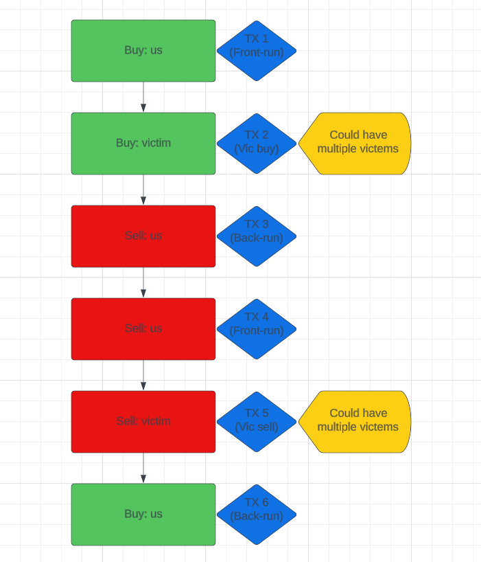

# **My collection of thoughts and ideas on different kinds of new strategies in the DeFi space.**

## **Table of Contents**

1. [New type of sandwhich ops](#new-type-of-sandwhich-ops)

- 1.1 [Deeper explaination of "New type of sandwhich ops"?](#deeper-explaination-of-new-type-of-sandwhich-ops)
  - 1.1.1 [Visual representation of the idea](#visual-representation-of-the-idea)
  - 1.1.2 [Explaintion of the chained-sandwhich method](#explaintion-of-the-chained-sandwhich-method)

2. [title](#title)
3. [title](#title)

## **New type of sandwhich ops**

### _Legenda_:

- **_buy_** = buy order by the bot
- **_sell_** = sell order by the bot
- **_Vbuy_** = buy order by a victim
- **_Vsell_** = sell order by a victim
- **_Lsell_** = large sell order by the bot
- **_Lbuy_** = large buy order by the bot

- **New type of sandwhich ops:** Basically what this "New type" will be or do is that it will take advantage of normal usual sandwiching, chains them together e.g. It would do normal sandwiching **buy**/**Vbuy**/**sell** and then after when it detects a **sell** order from someone it would **sell** again so it would do this: **sell**/**Vsell**/**buy**. So in the end it will look something like this: **buy**/**Vbuy**/**sell**/**sell**/**Vsell**/**buy**.

### **Deeper explaination of "New type of sandwhich ops"**

- #### **Visual representation of the idea:**
  ##### _This is a basic example_
  
- #### **Explaintion of the chained-sandwhich method**
  - So in the image above we see that we have 2 examples both do pretty much the same but the right example uses 1 step less. So the right image should be more gas effiecent, but it does rely on a user placing a sell order that will be front-runable
  - So again, the basic example shows that we can **buy**/**Vbuy**/**sell**/**sell**/**Vsell**/**buy**. But we can expand this and change this up depending on the transactions waiting in the mempool. Let's say we see a lot of buy orders and a lot of sell orders for a certain token. In this case, we can then do this:
    **buy**/**Vbuy**/**Vbuy**/**Vbuy**/**Vbuy**/**Vbuy**/**Lsell**/**Vsell**/**Vsell**/**Vsell**/**Lbuy**. With **Lsell** being the 12 ETH that we see in the right picture we pretty much front-ran TX 2 and then we sold just a little more than the 10 ETH that we originally bought in TX 1. This is because there was a sell order of another victim, our bot calculated the amount of slippage the selling victem had, and depending on that it will will sell the 10 ETH + the slippage amount. And then right after the **Vsell** it will buy back the initial selling amount that we sold. Resulting in a profit of X amount of ETH, because we were able to buy back the exact same amount of tokens at a lower price.
  - **Notice:** Sometimes we can only front-run sell side when ever we possess some tokens already. So in the beginning of launches we need to buy tokens and make sure they are not rugs or salmonella tokens.
  - Obviously we can expand this way more depending on the transactions in the mempool.